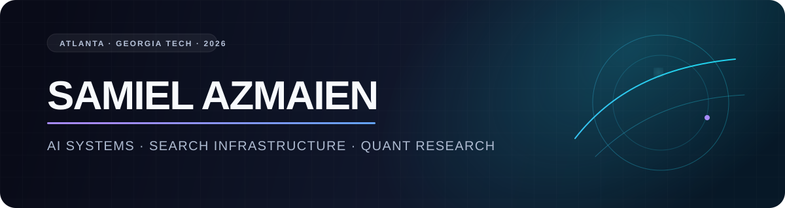

  

  <h3>Georgia Tech CS · building systems that make intelligence useful</h3>

  

    <a href="https://samiel-azmaien.github.io/">Portfolio</a>
    ·
    <a href="https://www.linkedin.com/in/samiel-azmaien/">LinkedIn</a>
    ·
    <a href="https://papers.ssrn.com/sol3/papers.cfm?abstract_id=4997415">Research</a>
  

## In the arena

- **Search infrastructure @ AWS** — designed a Unified Search MCP service for lexical and semantic retrieval across internal AI agents.
- **Co-founder @ Andromeda** — building prediction-market analytics, paper trading, and probability-driven strategy research.
- **AI model evaluation** — creating adversarial coding tasks, golden solutions, and tests that expose weak model reasoning.
- **Applied ML research** — published work spanning MRI-based FND diagnosis and predictive caching for GPU memory systems.

## Selected work

| Project | What it does | Signal |
|---|---|---|
| [Andromeda](https://andromeda-mhwofeqi1-kp30s-projects.vercel.app/) | Prediction-market analytics and paper trading with real-time P&L and Python backtesting. | Next.js · TypeScript · Supabase |
| [FND Neural Network Analysis](https://github.com/samiel-azmaien/Neural-Network-Analysis-of-MRI-Scans-for-FND-Diagnosis) | Combines MRI and clinical-history features to classify neurological disorders. | 92% accuracy · published research |
| [Swing State Probabilities](https://github.com/samiel-azmaien/datascience25) | Estimates swing-state probabilities at the precinct level in Gwinnett County. | TSA Data Science · 1st place |
| [GPU Markov Caching](https://isef.net/project/soft022t-optimizing-gpu-architecture-markov-based-caching) | Predicts V100 memory-block transitions to improve cache performance. | 85% L1 hit rate · ISEF |

## Working set

  
  
  
  
  
  
  

> I like hard problems at the intersection of systems, intelligence, and markets.

